<div align="center">

<h3><code>omkar@github ~ $ ./contributions.sh</code></h3>



<br><br>

<h3><code>omkar@github ~ $ whoami</code></h3>

<table>
<tr>
<td valign="top">

</td>

<td valign="top">

</td>
</tr>
</table>

<br>

<h3><code>omkar@github ~ $ cat about.txt</code></h3>

</div>

### 👋 About Me

I'm **Omkar Yelsange**, a Data Analyst & Data Engineering enthusiast with a B.E. in Robotics & Automation Engineering.

I enjoy working across the complete data lifecycle:

`Raw Data → Cleaning → SQL/Python → ETL → Analysis → Visualization → Business Insight`

My experience combines **data analytics, manufacturing data, SQL, Python, Power BI, cloud data platforms and machine-learning applications**.

I particularly enjoy converting raw operational data into structured information, dashboards and actionable insights.

### 🛠️ Tech Stack

**Languages & Analytics**

`Python` `SQL` `C++` `JavaScript` `R`

**Data & Databases**

`MySQL` `PostgreSQL` `MongoDB` `Pandas` `NumPy`

**BI & Visualization**

`Power BI` `Tableau` `Microsoft Excel` `Matplotlib` `Seaborn`

**Data Engineering & Cloud**

`Databricks` `PySpark` `AWS S3` `AWS Glue` `AWS Athena` `Lakehouse` `ETL`

**AI / ML**

`Scikit-learn` `Machine Learning` `NLP` `Generative AI` `Google Gemini API`

**Development**

`React.js` `Node.js` `Express.js` `Flask` `REST APIs` `Firebase`

**Tools**

`Git` `GitHub` `VS Code` `Postman` `Jupyter`

---

<div align="center">

<h3><code>omkar@github ~ $ ls projects/</code></h3>

</div>

### 🚀 Featured Projects

| Project                             | Description                                                            | Technologies                            |
| ----------------------------------- | ---------------------------------------------------------------------- | --------------------------------------- |
| 🏭 **GoodCabs Data Engineering**    | End-to-end transportation data pipeline using Medallion architecture   | `Databricks` `PySpark` `AWS S3` `SQL`   |
| 🏭 **Machine Monitoring Analytics** | Manufacturing and machine-performance analytics using operational data | `SQL` `Power BI` `Excel`                |
| 🚕 **Ola Data Analytics**           | Ride-booking analysis covering operational and business KPIs           | `SQL` `Excel` `Power BI`                |
| ⚡ **Zepto SQL Analytics**          | E-commerce product, pricing, discount and inventory analysis           | `SQL` `PostgreSQL`                      |
| 🛒 **Blinkit Grocery Analytics**    | Retail KPI analysis and interactive dashboard development              | `SQL` `Power BI` `Excel`                |
| 🏠 **Airbnb EDA**                   | Exploratory analysis of 20K+ accommodation listings                    | `Python` `Pandas` `NumPy` `Matplotlib`  |
| 🤖 **SAMS**                         | IoT + ML based predictive maintenance system                           | `Python` `ML` `IoT`                     |
| 🧠 **AI Chatbot**                   | NLP chatbot with Gemini API and Flask backend                          | `Python` `NLP` `Flask`                  |
| 🪑 **IoT Smart Chair**              | Smart posture and sitting-time monitoring system                       | `ESP32` `Python` `IoT` `Data Analytics` |

My data analytics portfolio is available in **[Data-Analytics-Projects](https://github.com/OmkarYelsange/Data-Analytics-Projects)**.

---

<div align="center">

<h3><code>omkar@github ~ $ ./highlights.sh</code></h3>

</div>

### 🏆 Highlights

- 🥇 **Best Innovation Award — DIPEX 2025**
- 📄 Research work on **IoT Smart Chair Kit**
- 🎓 **B.E. Robotics & Automation Engineering — D.Y. Patil College of Engineering, Pune**
- 📊 **Deloitte Data Analytics Virtual Internship — Forage**
- 🎓 **IBM Prompt Engineering Certification**
- 💼 Experience across **Data Analytics, Project Management and Full-Stack Development**
- 🏭 Hands-on exposure to **industrial/manufacturing data and operational analytics**

---

<div align="center">

<h3><code>omkar@github ~ $ currently_exploring</code></h3>

</div>

```python
current_focus = {
    "data": [
        "Advanced SQL",
        "Data Analysis",
        "Power BI",
        "Tableau"
    ],

    "data_engineering": [
        "Databricks",
        "PySpark",
        "ETL Pipelines",
        "Lakehouse Architecture",
        "AWS"
    ],

    "ai_ml": [
        "Machine Learning",
        "NLP",
        "Generative AI"
    ],

    "building": [
        "Data Analytics Projects",
        "Data Engineering Pipelines",
        "AI-powered Applications"
    ],

    "open_to": [
        "Data Analyst",
        "Data Engineer",
        "Business Intelligence",
        "AI/ML"
    ],

    "location": "Pune, India"
}
```

---

<div align="center">

<h3><code>omkar@github ~ $ connect</code></h3>

<p>
<a href="https://omkaryelsange.vercel.app">

</a>

<a href="https://www.linkedin.com/in/omkar-yelsange">

</a>

<a href="https://github.com/OmkarYelsange">

</a>
</p>

<br>

<code>Data drives decisions. I turn data into insights.</code>

</div>
