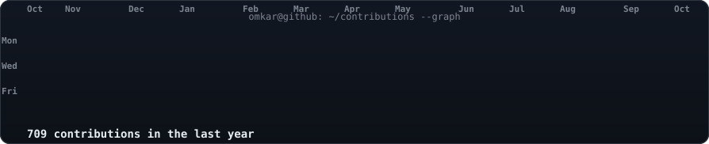

<!-- ===================== HEADER BANNER ===================== -->
<div align="center">

<h3><code>omkar@github ~ $ ./contributions.sh</code></h3>



<!-- <div align="center"> -->

<!-- 

</div> -->


<!-- <div align="center">

</div> -->

<a href="https://git.io/typing-svg">
  
</a>

<br/>

<a href="https://omkaryelsange.vercel.app"></a>
<a href="https://www.linkedin.com/in/omkar-yelsange"></a>
<a href="https://github.com/OmkarYelsange"></a>


<br/><br/>

<h3><code>omkar@github ~ $ whoami</code></h3>

<table>
<tr>
<td valign="top"></td>
<td valign="top"></td>
</tr>
</table>

<br><br>

<h3><code>omkar@github ~ $ ./links.sh</code></h3>

<p><b>Data Analyst · Aspiring Data Engineer · AI/ML Enthusiast</b></p>

[](https://omkary.vercel.app/)
[](https://www.linkedin.com/in/omkar-yelsange/)
[](https://www.instagram.com/omkar._2_0/)
[](https://x.com/Omkar_Yelsange)
[](https://github.com/OmkarYelsange)

</div>

---

## `omkar@github ~ $ cat profile.txt`

I’m **Omkar Yelsange**, a **Data Analyst** focused on SQL, Python, Power BI, data engineering, and applied AI/ML.

I enjoy taking messy operational data through the complete lifecycle:

`Raw Data` → `Cleaning` → `SQL / Python` → `ETL` → `Analysis` → `Visualization` → `Business Insight`

Currently, I work with data and operations while building toward roles in **Data Engineering, Business Intelligence, and AI/ML**.

### `omkar@github ~ $ ./focus.sh`

- 📊 Data Analytics & Business Intelligence
- 🏗️ Data Engineering & ETL
- ☁️ AWS & Databricks Lakehouse
- 🤖 Machine Learning, NLP & Generative AI
- 💻 Python, SQL & modern software development

### `omkar@github ~ $ ./stack.sh`

**Languages & Analytics**

`Python` `SQL` `C++` `JavaScript` `Pandas` `NumPy`

| 📊 Analytics | 🏗️ Engineering | 🤖 AI / ML | 🌐 Development |
| :---: | :---: | :---: | :---: |
| SQL, Python, Pandas | Databricks, PySpark | ML & NLP | React, Node.js |
| Power BI, Tableau | AWS S3 · Glue · Athena | Generative AI | REST APIs, Firebase |
| KPI & dashboard design | ETL & Lakehouse | Gemini API | Full-stack apps |

`Power BI` `Tableau` `Excel` `Matplotlib`

---

`Databricks` `PySpark` `AWS S3` `Athena` `Glue` `ETL` `Lakehouse`

**Databases**

`PostgreSQL` `MySQL` `MongoDB` `Firebase`

**📊 Languages & Analytics**

`Machine Learning` `NLP` `Generative AI` `Gemini API`

**🗄️ Data & Databases**

`React.js` `Node.js` `Express.js` `REST APIs` `Firebase Auth`

**📈 BI & Visualization**

`Git` `GitHub` `VS Code` `Postman` `Vercel` `Netlify`

### `omkar@github ~ $ ls projects/`

| Project | Description | Stack |
|---|---|---|
| 🚖 **GoodCabs Data Engineering** | End-to-end transportation pipeline using Bronze / Silver / Gold architecture | `Databricks` `PySpark` `AWS S3` `SQL` |
| 🚕 **OLA Ride Analytics** | Booking, revenue, cancellation and operational KPI analysis | `SQL` `Power BI` `Excel` |
| ⚡ **Zepto Analytics** | Product, pricing, discount, inventory and e-commerce analysis | `SQL` `PostgreSQL` `Power BI` |
| 🏠 **Airbnb EDA** | Exploratory analysis of 20K+ accommodation listings | `Python` `Pandas` `NumPy` `Matplotlib` |
| 🤖 **AI Chatbot** | NLP chatbot with Flask backend and Gemini API | `Python` `NLP` `Flask` |
| 🏭 **SAMS** | Sensor-driven machine / abrasive monitoring and predictive-maintenance oriented analytics | `Python` `ML` `IoT` |
| 🪑 **IoT Smart Chair** | Posture and sitting-time monitoring with a custom analytics dashboard | `ESP32` `Python` `IoT` |
| 💻 **Mini Chat App** | Real-time browser chat application | `Node.js` `Express` `Socket.io` `Firebase` |

### `omkar@github ~ $ cat highlights.txt`

- 🏆 **Best Innovation Award — DIPEX 2025**
- 📄 Research work on the **IoT Smart Chair Kit**
- 🎓 **B.E. Robotics & Automation Engineering** — D.Y. Patil College of Engineering, Pune
- 🧠 Prompt-engineering / Generative-AI focused learning
- 📊 Hands-on experience across **Data Analytics, Operations, Project Management and Full-Stack Development**

### `omkar@github ~ $ tail -f learning.log`

```text
Advanced SQL             [██████████████████░░]
Data Engineering         [████████████████░░░░]
Databricks / PySpark     [███████████████░░░░░]
AWS Data Services        [██████████████░░░░░░]
Machine Learning         [████████████░░░░░░░░]
Generative AI            [██████████████░░░░░░]
```

### `omkar@github ~ $ ./connect.sh`

> Data drives decisions. I turn data into insights.

📍 Pune, Maharashtra, India  
🌐 Portfolio: https://omkary.vercel.app/  
💼 LinkedIn: https://www.linkedin.com/in/omkar-yelsange/

---

<sub>
Contribution art is generated in this repository from GitHub’s public contribution calendar.
The GitHub Action refreshes the heatmap and stats automatically.
</sub>
