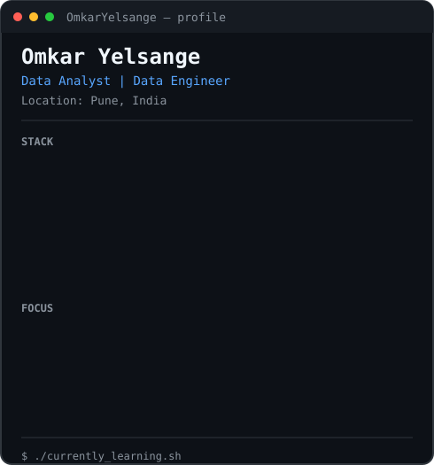
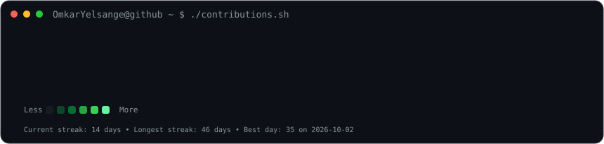

<!-- ===================== HEADER BANNER ===================== -->
<div align="center">

 

<a href="https://git.io/typing-svg">
  
</a>

<br/>

<a href="https://omkaryelsange.vercel.app"></a>
<a href="https://www.linkedin.com/in/omkar-yelsange"></a>
<a href="https://github.com/OmkarYelsange"></a>


<br/><br/>

<table>
  <tr>
    <td valign="top">
      
    </td>
    <td>
      
    </td>
  </tr>
</table>

</div>

---

## 👋 About Me

I'm **Omkar Yelsange**, a **Data Analyst & Data Engineering enthusiast** with a **B.E. in Robotics & Automation Engineering**. I turn raw operational data into structured information, dashboards, and actionable business insight.

> **My workflow across the complete data lifecycle**

<div align="center">

`Raw Data` ➜ `Cleaning` ➜ `SQL / Python` ➜ `ETL` ➜ `Analysis` ➜ `Visualization` ➜ `Business Insight`

</div>

**Core strengths:** Data Analytics · Data Engineering · SQL · Python · Power BI · Databricks · Machine Learning

---

## 💪 Strengths at a Glance

<div align="center">

| 📊 Analytics | 🏗️ Engineering | 🤖 AI / ML | 🌐 Development |
| :---: | :---: | :---: | :---: |
| SQL, Python, Pandas | Databricks, PySpark | ML & NLP | React, Node.js |
| Power BI, Tableau | AWS S3 · Glue · Athena | Generative AI | REST APIs, Firebase |
| KPI & dashboard design | ETL & Lakehouse | Gemini API | Full-stack apps |

</div>

---

## 🛠️ Tech Stack

**📊 Languages & Analytics**


**🗄️ Data & Databases**


**📈 BI & Visualization**


**☁️ Data Engineering & Cloud**


**🤖 AI / ML**


**💻 Development**


**🧰 Tools**


---

## 🚀 Featured Projects

| Project | What it does | Tech |
| :-- | :-- | :-- |
| 🚖 **GoodCabs Data Engineering** | End-to-end transportation data pipeline using **Medallion architecture** | `Databricks` `PySpark` `AWS S3` `SQL` |
| 🏭 **Machine Monitoring Analytics** | Manufacturing & machine-performance analytics from operational data | `SQL` `Power BI` `Excel` |
| 🚕 **Ola Data Analytics** | Ride-booking analysis covering operational and business KPIs | `SQL` `Excel` `Power BI` |
| ⚡ **Zepto SQL Analytics** | E-commerce product, pricing, discount and inventory analysis | `SQL` `PostgreSQL` |
| 🛒 **Blinkit Grocery Analytics** | Retail KPI analysis and interactive dashboard development | `SQL` `Power BI` `Excel` |
| 🏠 **Airbnb EDA** | Exploratory analysis of **20K+** accommodation listings | `Python` `Pandas` `NumPy` `Matplotlib` |
| 🤖 **SAMS** | IoT + ML based predictive maintenance system | `Python` `ML` `IoT` |
| 🧠 **AI Chatbot** | NLP chatbot with Gemini API and Flask backend | `Python` `NLP` `Flask` |
| 🪑 **IoT Smart Chair** | Smart posture and sitting-time monitoring system | `ESP32` `Python` `IoT` `Data Analytics` |

<div align="center">

📂 **Full analytics portfolio →** [**Data-Analytics-Projects**](https://github.com/OmkarYelsange/Data-Analytics-Projects)

</div>

---

## 🏆 Highlights

- 🥇 **Best Innovation Award — DIPEX 2025**
- 📄 Research work on **IoT Smart Chair Kit**
- 🎓 **B.E. Robotics & Automation Engineering** — D.Y. Patil College of Engineering, Pune
- 📊 **Deloitte Data Analytics Virtual Internship** — Forage
- 🧠 **IBM Prompt Engineering Certification**
- 💼 Experience across **Data Analytics, Project Management and Full-Stack Development**
- 🏭 Hands-on exposure to **industrial data and operational analytics**

---

## 🔭 Currently Exploring

```python
current_focus = {
    "data": ["Advanced SQL", "Data Analysis", "Power BI", "Tableau"],
    "data_engineering": ["Databricks", "PySpark", "ETL Pipelines", "Lakehouse Architecture", "AWS"],
    "ai_ml": ["Machine Learning", "NLP", "Generative AI"],
    "building": ["Data Analytics Projects", "Data Engineering Pipelines", "AI-powered Applications"],
    "open_to": ["Data Analyst", "Data Engineer", "Business Intelligence", "AI/ML"],
    "location": "Pune, India",
}
```

---

## 📈 GitHub Stats

<div align="center">


</div>

---

<div align="center">

### 🤝 Let's Connect

<a href="https://omkaryelsange.vercel.app"></a>
<a href="https://www.linkedin.com/in/omkar-yelsange"></a>
<a href="https://github.com/OmkarYelsange"></a>

<br/><br/>

**`Data drives decisions. I turn data into insights.`**


</div>
